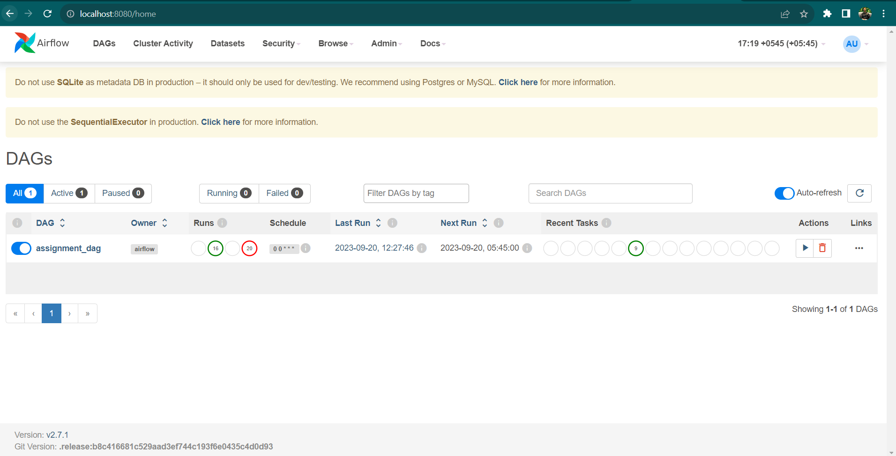
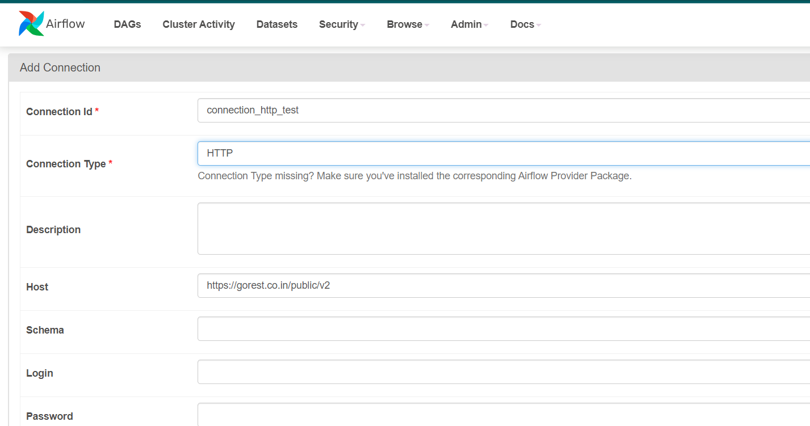
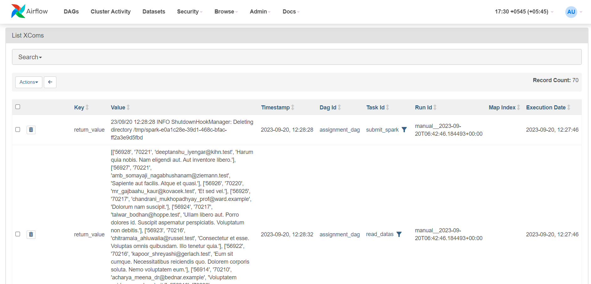
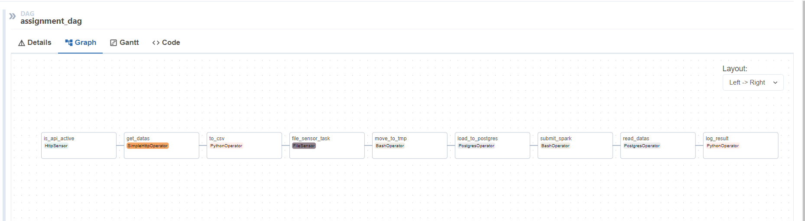
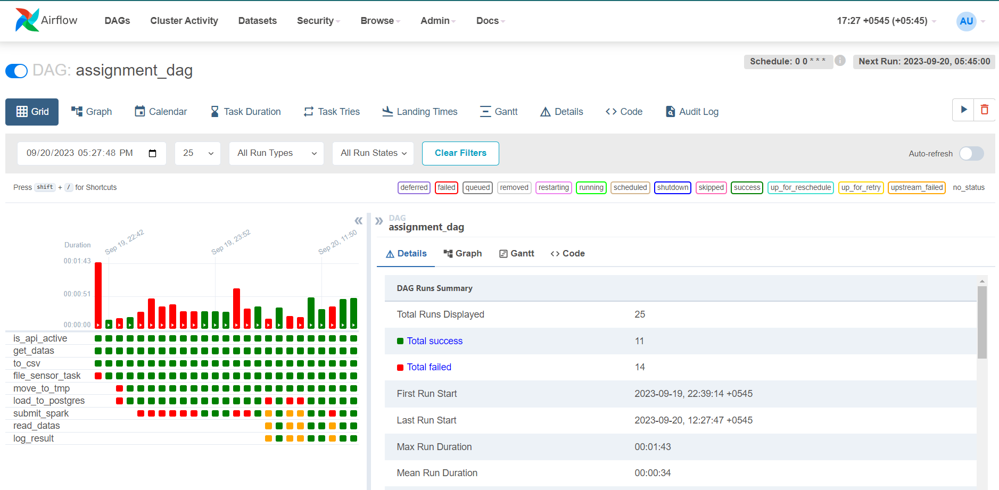
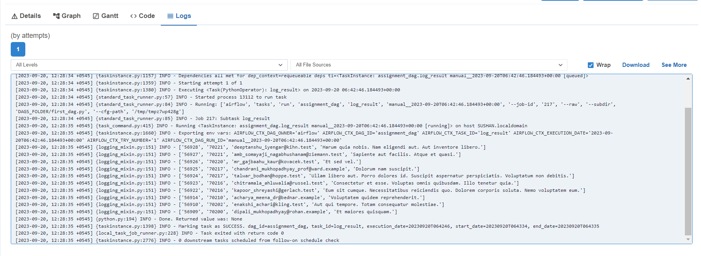

# Airflow DAG and Spark Script

## Introduction

This repo provides an overview of two parts: an Apache Airflow DAG (`assignment_dag.py`) and a Spark script (`pyscripts.py`). These scripts work together to arrange a data pipeline, fetch data from an API, process it, and store it in both a Parquet file and a PostgreSQL database.

## Airflow DAG (`assignment_dag.py`)

### Description

The Airflow DAG named `assignment_dag.py` arrange the data pipeline, which includes the following tasks:

1. **is_api_active**: This HTTP sensor checks if the API is active.

2. **get_api_data**: This HTTP operator fetches data from the API and stores it in XCom.

3. **to_csv**: This Python operator converts the fetched JSON data to CSV and saves it to a file.

4. **file_sensor_task**: This file sensor waits for the CSV file to be created.

5. **move_to_tmp**: This Bash operator moves the CSV file to the `/tmp` directory.

6. **load_to_postgres**: This PostgreSQL operator truncates an existing table and copies data from the CSV file to a PostgreSQL table.

7. **for_spark_submit**: This Bash operator submits a Spark job using `spark-submit`.

8. **from_postgres**: This PostgreSQL operator reads data from the PostgreSQL table.

9. **log_result_task**: This Python operator logs the data fetched from PostgreSQL.

10. **Dependencies**: `is_api_active>>get_api_data>>to_csv>>file_sensor_task>>move_to_tmp>>load_to_postgres>>for_spark_submit>>from_postgres>>log_result_task
`
- The next task will run only after completion of it's previous task.

### Usage

- The DAG is scheduled to run daily at 12 AM.
- Make sure to configure connections and paths as per your environment.

## Spark Script (`pyscripts.py`)

### Description

The Spark script named `pyscripts.py` complements the Airflow DAG and performs the following tasks:

1. Initializes a Spark session, sets up configuration, and reads credentials from a YAML file.

2. Reads data from a CSV file located at "/tmp/datas.csv" into a Spark DataFrame, setting the first row as the header.

3. Sets up JDBC properties, including the JDBC URL, username, password, and driver.

4. Performs data transformation by dropping the "name" column from the DataFrame.

5. Writes the modified DataFrame to a Parquet file located at "/home/sushan/airflow/airflow_output/comments.parquet" in "overwrite" mode.

6. Writes the modified DataFrame to a PostgreSQL table named "new_comments_table" using the JDBC URL and properties.

7. Displays the contents of the modified DataFrame.

8. Stops the Spark session.

### Usage

- Ensure you have Spark and PostgreSQL set up correctly in your environment.
- Adjust file paths, configurations, and credentials as needed.

### API Used
- The API used in this project is from `https://gorest.co.in/public/v2/posts`

### Screenshots

## Airflow UI:
* The Airflow UI runs in localhost:8080. A brief view of the homepage of the UI is presented here:

## Adding Connection
* The HTTPConnection and postgres connection were added. To add the connection: `Admin-> Connections -> add_connection_button(+)`

 **HTTPConnection**
 

 **PostgresConnection**
 

## Xcom in Airflow UI
* In Airflow UI, the XCOM is at `Admin>>Xcoms`.
 

## Logs
* In Graph View

* In Bar View

* Final Output On LOG

## Conclusion

These all work together to fetch, process, and store data efficiently in a data pipeline. Customize the configurations and paths to fit your specific use case.
